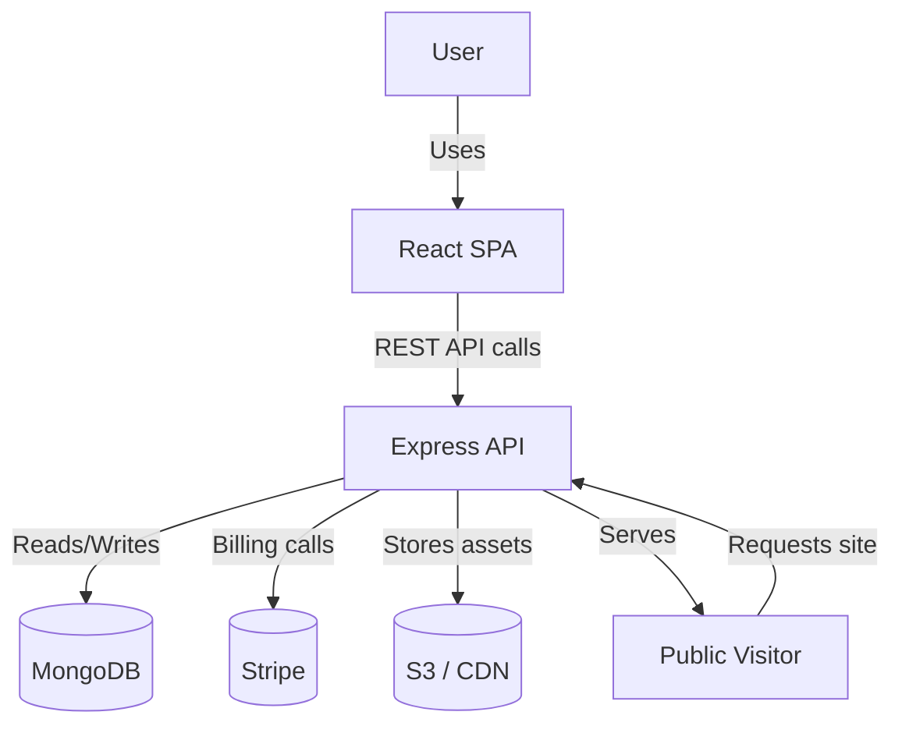
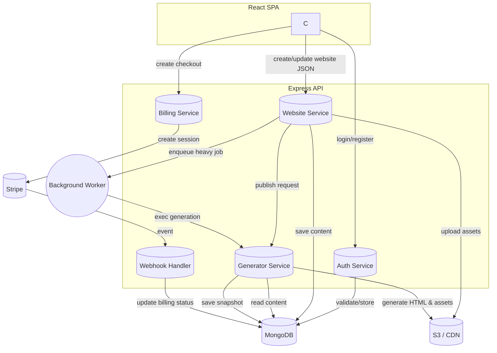
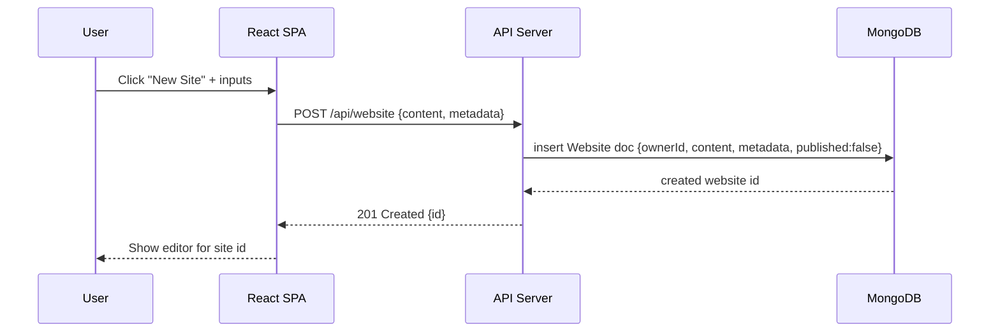
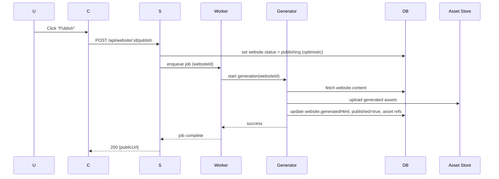
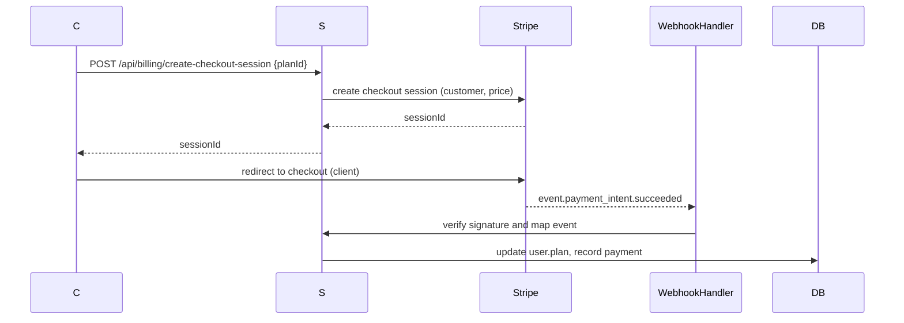

# WebsiteBuilder — Architecture & Data Flow Diagrams

## Purpose
This document provides a full architecture overview and exact data flow diagrams (DFD levels 0–2) for the WebsiteBuilder project. It complements `docs/low_level_design.md` by visualizing components, data stores, and detailed information flows.

---

## 1. Architecture Overview
- Client: React (Vite) SPA in `client/` — handles UI, routing, editor, and calls backend APIs.
- Server: Node.js + Express in `server/` — exposes REST API, controllers, middleware, Stripe integration, webhook handlers.
- Database: MongoDB via Mongoose — stores `User`, `Website`, billing metadata, and generated snapshots.
- External Services: Stripe (billing), CDN/S3 (asset hosting), optional background worker for heavy generation tasks.

Key runtime subsystems on server:
- Auth Service: login/register, JWT issuance/validation.
- Website Service: CRUD for websites, autosave, publish flow.
- Generator Service: converts `content` JSON -> static HTML snapshot and assets.
- Billing Service: Stripe checkout/session management + webhook handling.
- Asset Store: S3/local file store for images and static assets.
- Background Worker (optional): offloads CPU-heavy generation or image processing.

---

## 2. Component Diagram (Mermaid)

```mermaid
flowchart LR
  subgraph Browser
    U[User]
    C[React SPA]
  end

  subgraph Server[API Server (Express)]
    A[Auth Service]
    W[Website Service]
    G[Generator Service]
    B[Billing Service]
    H[Webhook Handler]
  end

  DB[(MongoDB)]
  STRIPE[(Stripe)]
  ASSET[Asset Store / CDN]
  WORKER[Background Worker]

  U -->|interacts| C
  C -->|HTTPS REST| A
  C -->|HTTPS REST| W
  C -->|HTTPS REST| B
  A -->|CRUD| DB
  W -->|CRUD| DB
  W -->|store assets| ASSET
  W -->|enqueue| WORKER
  G -->|read content| DB
  G -->|write snapshot| DB
  B -->|create session| STRIPE
  H -->|stripe events| B
  H -->|update| DB
  WORKER -->|call| G
  C -->|fetch public site| W
  W -->|serve static html| ASSET
```

---

## 3. Data Flow Diagram — Level 0 (Context)

This is a high-level context diagram showing primary actors and data stores.



Data flows (L0):
- User -> Client: UI interactions, site editing, publish actions.
- Client -> Server: API calls for auth, website CRUD, publish, billing.
- Server -> MongoDB: persistent storage of users, websites, snapshots.
- Server -> Stripe: create checkout/session; Stripe -> Server via webhook.
- Server -> CDN: upload assets; CDN serves public assets.

---

## 4. Data Flow Diagram — Level 1 (Processes & Stores)

Breakdown of main server processes and how data moves between them.



Data elements stored in DB:
- `User`: email, passwordHash, stripeCustomerId, plan
- `Website`: ownerId, title, slug, content(JSON), settings, generatedHtml, assets[], published
- `Billing`: invoices, subscriptions, webhook logs (optionally)

---

## 5. Data Flow Diagram — Level 2 (Detailed flows)

### 5.1 Create Website (detailed)



Data passed: content JSON, metadata (title, slug), ownerId set from auth.

### 5.2 Publish Website (detailed)



Notes: enqueueing allows async non-blocking user experience.

### 5.3 Billing Checkout + Webhook (detailed)



---

## 6. Exact Data Elements & Types

User (MongoDB document)
- _id: ObjectId
- email: string (unique)
- passwordHash: string
- name: string
- stripeCustomerId: string
- plan: string
- createdAt: Date
- updatedAt: Date

Website (MongoDB document)
- _id: ObjectId
- ownerId: ObjectId (ref `User`)
- title: string
- slug: string
- content: JSON (component tree)
- settings: JSON (theme, domain, SEO)
- generatedHtml: string
- assets: [{key, url, storageType, contentType}]
- published: boolean
- createdAt, updatedAt: Date

Billing (optional collection)
- _id: ObjectId
- userId: ObjectId
- stripeSubscriptionId: string
- status: string
- invoices: [stripeInvoiceId]
- createdAt, updatedAt

---

## 7. API to Data Mapping (summary)
- POST /api/auth/register -> create `User`
- POST /api/auth/login -> auth; no DB change except lastLogin
- POST /api/website -> create `Website`
- PUT /api/website/:id -> update `Website.content`
- POST /api/website/:id/publish -> triggers Generator -> update `Website.generatedHtml`, `published`
- POST /api/billing/create-checkout-session -> create Stripe Checkout -> no immediate DB change
- POST /api/billing/webhook -> update `User.plan` / `Billing` records

---

## 8. Security & Integrity Controls (DFD-related)
- Verify all incoming webhook payloads using Stripe signature header.
- Authenticate requests to protected endpoints; attach `req.user` from JWT.
- Validate `content` JSON schema before storing or generating.
- Escaping/sanitization in generator to avoid XSS in generated HTML.
- Use TLS for all client-server and server-external calls.

---

## 9. Next steps and exports
- Option: render the Mermaid diagrams to PNG/SVG for documentation use.
- Option: generate an OpenAPI spec that maps the APIs described above.
- Option: implement Mongoose schema files for `User` and `Website`.

---

Document created. If you want, I can render and save the Mermaid diagrams as images, or produce an OpenAPI spec next.
